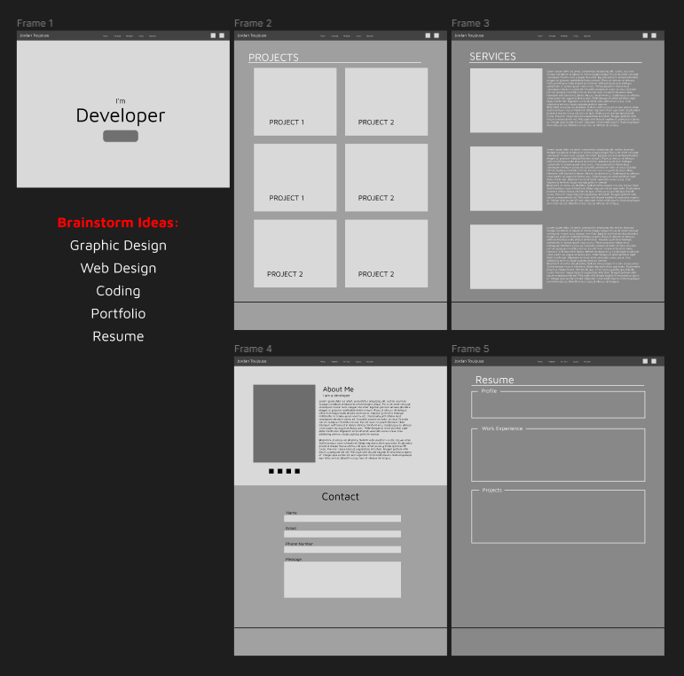

# Capstone Project - Pathway 1
This project is the final project for Pathway One.   It is to show what we have learned so far in class.

## Technologies
In this project HTML, CSS, Javascript was used.  The projet was uploaded to Github to share and show my code.

## Stratagy
The stratagy was to make a personal and professional website. That showcases our skills.

## Style and Color
The decided to use a dark them with a color of aqua of accents.  

## Wireframe
I used a wireframe to show the basic layout of my website.

